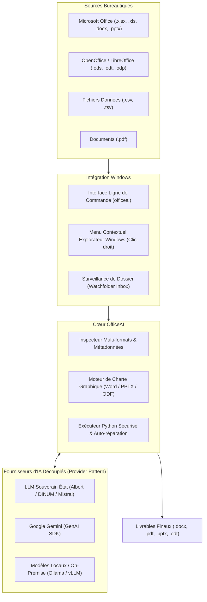

# Cahier des Charges & Spécification Technique : OfficeAI

---

## 1. Contexte & Vision Stratégique

### 1.1 Contexte
Dans les environnements professionnels et administratifs (notamment sur poste de travail Windows), les agents et collaborateurs manipulent quotidiennement un volume important de documents bureautiques :
- Tableurs de suivi des ventes, budgets, statistiques régionales (`.xls`, `.xlsx`, `.ods`, `.csv`).
- Documents textuels et rapports institutionnels (`.docx`, `.odt`).
- Présentations managériales (`.pptx`, `.odp`).
- Documents finaux de diffusion (`.pdf`).

La production manuelle de synthèses périodiques, l'extraction de données et la mise en forme selon une charte graphique imposée représentent une charge chronophage, répétitive et sujette aux erreurs de saisie.

### 1.2 Vision du Projet
**OfficeAI** est un assistant bureautique modulaire et sécurisé conçu pour le poste de travail Windows. Il permet de :
1. **Comprendre et analyser** des documents existants en langage naturel.
2. **Générer des documents finaux de haute qualité** (Word, PowerPoint, PDF, OpenOffice) respectant scrupuleusement la charte graphique et l'identité visuelle de l'organisation.
3. **Automatiser les traitements de masse (Batch)** et la **surveillance de dossiers (Watchfolder)**.
4. **Garantir la souveraineté et la confidentialité des données** via une architecture multi-fournisseurs d'IA intégrant le **LLM souverain de l'État (Albert / DINUM / Mistral AI SecNumCloud)** en complément de Google Gemini.



---

## 2. Exigences Fonctionnelles

### 2.1 Prise en Charge Multi-Formats

| Catégorie | Formats Pris en Charge | Bibliothèque Python Sous-jacente | Rôle / Capacités |
| :--- | :--- | :--- | :--- |
| **Tableurs** | `.xlsx`, `.xlsm`<br>`.xls` (Excel 97-2003)<br>`.ods` (OpenDocument Calc)<br>`.csv`, `.tsv` | `openpyxl`, `pandas`<br>`xlrd`<br>`odfpy`, `pandas`<br>`pandas` | Lecture, calculs statistiques, agrégations, filtres, pivots et export. |
| **Traitements de texte** | `.docx`<br>`.odt` (OpenDocument Text) | `python-docx`, `docxtpl`<br>`odfpy`, `pypandoc` / LibreOffice CLI | Clonage de charte graphique, injection de données, tableaux zébrés, balises Jinja2. |
| **Présentations** | `.pptx`<br>`.odp` (OpenDocument Impress) | `python-pptx`<br>`odfpy` / LibreOffice CLI | Création automatique de diapositives, graphiques visuels, respect du masque de diapositives. |
| **Documents Diffusables** | `.pdf` | `pypdf`, `pdfplumber`, `pymupdf` (fitz) | Extraction de texte/tableaux et conversion finale de `.docx`/`.odt` en `.pdf`. |

---

### 2.2 Respect de la Charte Graphique & Modèles

Le système doit supporter deux modes d'application de charte :
1. **Mode Héritage de Style (Style Cloning)** :
   - L'utilisateur fournit un document de référence existant (ex: `modele.docx` ou `charte.pptx`).
   - L'outil extrait et reproduit fidèlement :
     - La palette de couleurs (primaire, secondaire, fonds de tableau).
     - La typographie (polices système de l'organisation : Arial, Calibri, Marianne pour l'État, Aptos, etc.).
     - Les en-têtes et pieds de page institutionnels (logos, mentions légales, pagination).
     - Les marges et orientations.
2. **Mode Gabarit Dynamique (Template Jinja2)** :
   - Remplissage automatisé de variables balisées (ex: `{{ chiffre_affaires }}`) et de boucles de tableaux (``).

---

### 2.3 Intégration Windows Native

#### A. Menu Contextuel de l'Explorateur Windows
- Ajout d'une entrée au clic-droit sur un fichier ou un dossier : **« Traiter avec OfficeAI »**.
- Ouvre une invite de commande interactive ou exécute un profil d'analyse prédéfini.
- Installation et désinstallation automatisée via des commandes dédiées :
  ```powershell
  officeai windows install-context-menu
  officeai windows uninstall-context-menu
  ```

#### B. Surveillance Automatique de Répertoire (Watchfolder)
- Définition d'un dossier surveillé (ex: `./inbox` ou `C:\Dossier_Partagé\Ventes_A_Traiter`).
- Dès qu'un nouveau fichier y est déposé :
  1. OfficeAI détecte l'événement (`watchdog`).
  2. Il applique la tâche configurée (ex: "Générer le rapport Word selon modele.docx").
  3. Il dépose le document final dans `./outbox` et archive la source dans `./archives`.
- Commande :
  ```powershell
  officeai watch --folder "./inbox" --recipe "analyse_ventes"
  ```

---

### 2.4 Multi-Fournisseurs d'IA & Souveraineté de l'État

Pour répondre aux impératifs de souveraineté des données, de conformité RGPD et de secret professionnel dans le secteur public ou les entreprises réglementées :

```
                        ┌───────────────────────────────────────────────┐
                        │              Provider Router                  │
                        └───────┬───────────────┬───────────────┬───────┘
                                │               │               │
                                ▼               ▼               ▼
                       ┌────────────────┐┌─────────────┐┌───────────────┐
                       │  État / Albert ││    Mistral  ││ Google Gemini │
                       │ (DINUM / Etalab││ SecNumCloud ││  (GenAI SDK)  │
                       └────────────────┘└─────────────┘└───────────────┘
```

1. **Fournisseur Souverain de l'État (Albert / DINUM)** :
   - Connexion à l'API Albert de la Direction Interministérielle du Numérique (DINUM).
   - Utilisation de modèles hébergés sur infrastructures étatiques / SecNumCloud.
2. **Fournisseur Mistral AI (Souverain européen)** :
   - Modèles Mistral Small / Large hébergés en France/Europe.
3. **Fournisseur Google Gemini** :
   - Prise en charge des modèles haute performance `gemini-2.5-flash` et `gemini-2.5-pro`.
4. **Modèles Locaux Déconnectés (Ollama / vLLM)** :
   - Fonctionnement 100% hors-ligne (Air-gapped) sur le poste de travail pour les données hautement confidentielles.

**Sélection du fournisseur :**
```powershell
# Configuration globale
officeai config --provider albert --api-key "CLE_ETAT"

# Ou à la volée par commande
officeai run "..." --provider mistral
officeai run "..." --provider gemini
```

---

## 3. Architecture Technique & Sécurité

### 3.1 Architecture Modulaire

```
officeai/
├── cli.py                     # Commandes Typer (run, batch, inspect, watch, windows, config)
├── config.py                  # Gestionnaire multi-providers et variables d'environnement
├── core/
│   ├── agent.py               # Orchestrateur de tâches
│   ├── runner.py              # Exécuteur local avec capture d'erreurs et codage UTF-8
│   └── providers/             # Fournisseurs d'IA interchangeables
│       ├── base.py            # Interface abstraite LLMProvider
│       ├── gemini_provider.py # Client Google GenAI
│       ├── albert_provider.py # Client API Souveraine Albert / DINUM
│       ├── mistral_provider.py# Client Mistral AI
│       └── local_provider.py  # Client Ollama / OpenAI-compatible
├── inspectors/                # Extraction de métadonnées sans envoi des données brutes
│   ├── excel_inspector.py     # .xlsx, .xls, .csv
│   ├── odf_inspector.py       # .ods, .odt, .odp (OpenOffice)
│   ├── word_inspector.py      # .docx (charte et balises)
│   ├── pptx_inspector.py      # .pptx (masques et thèmes)
│   └── pdf_inspector.py       # .pdf (texte et tables)
├── templates/
│   ├── docx_styler.py         # Moteur Word (python-docx + docxtpl)
│   ├── pptx_styler.py         # Moteur PowerPoint (python-pptx)
│   └── odf_styler.py          # Moteur OpenOffice (odfpy)
├── batch/
│   └── batch_processor.py     # Traitement par lot avec barres de progression
└── windows/
    ├── context_menu.py        # Gestion des clés de registre Windows pour le clic droit
    └── watcher.py             # Surveillance de répertoire en tâche de fond (watchdog)
```

### 3.2 Sécurité & Confidentialité des Données

> [!IMPORTANT]
> **Principe du « Zéro Donnée Brute Envoyée au LLM »**
> Pour préserver le secret professionnel et le RGPD :
> 1. **Seul le schéma technique** (nom des colonnes, type de données, 3 exemples anonymisés) est transmis au LLM pour concevoir le code de calcul.
> 2. **L'intégralité du calcul et du traitement volumétrique** est effectuée **localement** sur la machine de l'utilisateur par l'interpréteur Python.
> 3. Aucune donnée nominative ou chiffrée n'est partagée avec les serveurs d'IA distants.

---

## 4. Feuille de Route (Roadmap)

### Version 0.1 (✅ Terminée et Validée)
- [x] Initialisation du projet avec `uv` et structure modulaire.
- [x] Intégration de Google Gemini (`google-genai`).
- [x] Inspecteur Excel (`.xls` legacy via xlrd, `.xlsx`, `.csv`).
- [x] Inspecteur Word (`.docx`, détection styles, polices, Jinja2).
- [x] Moteur de clonage de charte graphique [`DocxStyler`](file:///C:/Users/jga97/Nextcloud/python/officeAI/officeai/templates/docx_styler.py).
- [x] Runner sécurisé avec encodage Windows (`PYTHONIOENCODING=utf-8`) et boucle d'auto-correction.
- [x] Traitement par lot (Batch) avec barre de progression `rich`.
- [x] CLI complète (`run`, `batch`, `inspect`, `config`, `chat`).
- [x] Suite de tests unitaires `pytest` (5/5 passés).
- [x] Validation sur le cas d'usage réel : `f1.xls` + `modele.docx` -> `rapport_ventes.docx`.

---

### Version 1.0 (En cours de formalisation)
- [ ] **Découplage Multi-LLM (Provider Pattern)** :
  - Interface commune `LLMProvider`.
  - Intégration du **LLM Souverain de l'État (Albert / DINUM)**.
  - Intégration de **Mistral AI** et support des points d'accès locaux (**Ollama**).
- [ ] **Support OpenOffice / LibreOffice (ODF)** :
  - Support de lecture/écriture pour `.ods` (tableurs) et `.odt` (textes).
- [ ] **Génération de graphiques automatiques** :
  - Module `ChartStyler` basé sur `matplotlib` créant des graphiques aux couleurs de la charte pour inclusion directe dans les rapports.

---

### Version 2.0
- [ ] **Support PowerPoint (`.pptx`, `.odp`)** :
  - Génération de jeux de diapositives d'après une charte de présentation d'entreprise.
- [ ] **Conversion & Lecture PDF** :
  - Conversion automatique des documents générés en PDF prêt à l'impression via LibreOffice CLI ou moteur natif.
  - Extraction de données depuis des factures et bilans PDF.
- [ ] **Intégration Windows native** :
  - Script d'intégration au menu contextuel Windows (clic droit sur un fichier ou un dossier).

---

### Version 3.0
- [ ] **Mode Surveillance de Dossier (Watchfolder)** :
  - Daemon Windows / service en arrière-plan surveillant un dossier de dépôt pour automatiser les flux récurrents sans intervention humaine.
- [ ] **Interface Graphique Légère (Desktop GUI)** :
  - En complément de la CLI, tableau de bord visuel pour visualiser les lots en cours et configurer les recettes de traitement.

---

## 5. Critères d'Acceptation & Validation

1. **Fidélité de la charte graphique** : Le document Word ou ODT généré doit reprendre les polices exactes, marges et couleurs de titre du modèle de référence.
2. **Interopérabilité** : Capacité de traiter indifféremment des fichiers Microsoft Office (`.xlsx`, `.docx`) et OpenOffice/LibreOffice (`.ods`, `.odt`).
3. **Souveraineté** : Bascule immédiate entre Gemini, Mistral et Albert par simple option CLI sans modification de code.
4. **Stabilité Windows** : Absence totale de blocages liés à l'encodage de caractères (accents français, symboles monétaires `€`, caractères spéciaux).
